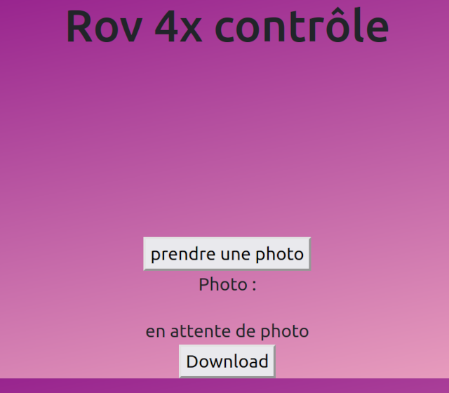

# Mini-projet ROV4x 2022

## Présentation

Il s’agit de réaliser un robot capable de se déplacer dans milieu hostile (contaminé), afin de réaliser des mesures et de prises de vues.

Le robot sera muni d’un câble, utilisé comme fil d’Ariane pour récupérer le robot en cas de panne ou de dysfonctionnement dans l’enceinte contaminée.

## Objectifs

Les fonctionnalités demandées sont :

- Communiquer via une liaison série avec une application logiciel web :
  - Envoyer des données mise en forme à partir des données issues des différents capteurs.
  - Récupérer des commandes et/ou paramètres de configuration pour le module électronique.
- Mettre en œuvre les différents capteurs.
- Mettre en œuvre les différents actionneurs.
- Élaborer le code source nécessaire au fonctionnement du module sous PlatformIO.
- Mettre en forme les données.
- Valider le choix des capteurs en fonction du cahier des charges.
- Communiquer via une liaison série avec un système embarqué réalisé par l&#39;étudiant EC afin de :
    - récupérer des données en provenance du module électronique
    - envoyer des commandes et/ou paramètres de configuration au module électronique
- Produire une IHM web afin :
    - d'afficher des données en provenance du module électronique
    - de commander et/ou paramétrer le module électronique
    - stocker des données et/ou des paramètres de configuration dans une base de données

